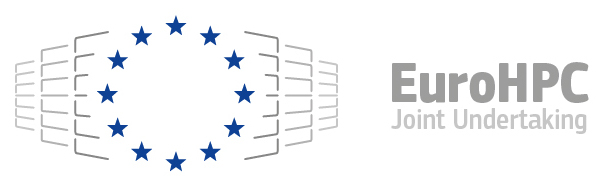

[](https://github.com/Parallel-in-Time/pySDC/actions/workflows/ci_pipeline.yml)
[](https://bestpractices.coreinfrastructure.org/projects/6909)
[](https://codecov.io/gh/Parallel-in-Time/pySDC)
[](https://zenodo.org/badge/latestdoi/26165004)
[](https://fair-software.eu)
[](https://api.eu.badgr.io/public/assertions/aS8J0NDTTjCyYP6iVufviQ "SQAaaS silver badge achieved")

# Welcome to pySDC!

The `pySDC` project is a Python implementation of the
spectral deferred correction (SDC) approach and its flavors, esp. the
multilevel extension MLSDC and PFASST. It is intended for rapid
prototyping and educational purposes. New ideas like e.g. sweepers or
predictors can be tested and first toy problems can be easily
implemented.

## Features

-   Variants of SDC: explicit, implicit, IMEX, multi-implicit, Verlet,
    multi-level, diagonal, multi-step
-   Variants of PFASST: virtual parallel or MPI-based parallel,
    classical of multigrid perspective
-   8 tutorials: from setting up a first collocation problem to SDC,
    PFASST and advanced topics
-   Projects: many documented projects with defined and tested outcomes
-   Many different examples, collocation types, data types already
    implemented
-   Works with [FEniCS](https://fenicsproject.org/),
    [mpi4py-fft](https://mpi4py-fft.readthedocs.io/en/latest/) and
    [PETSc](http://www.mcs.anl.gov/petsc/) (through
    [petsc4py](https://bitbucket.org/petsc/petsc4py))
-   Continuous integration via [GitHub
    Actions](https://github.com/Parallel-in-Time/pySDC/actions) and
    [Gitlab CI](https://gitlab.hzdr.de/r.speck/pysdc/-/pipelines)
-   Fully compatible with Python 3.7 - 3.10, runs at least on Ubuntu and
    MacOS

## Getting started

The code is hosted on GitHub, see
<https://github.com/Parallel-in-Time/pySDC>, and PyPI, see
<https://pypi.python.org/pypi/pySDC>. While using `pip install pySDC`
will give you a core version of `pySDC` to work with,
working with the developer version is most often the better choice. We
thus recommend to checkout the code from GitHub and install the
dependencies e.g. by using a [conda](https://conda.io/en/latest/)
environment. For this, `pySDC` ships with environment files
which can be found in the folder `etc/`. Use these as e.g.

``` bash
conda env create -f etc/environment-base.yml
```

To check your installation, run

``` bash
pytest pySDC/tests -m NAME
```

where `NAME` corresponds to the environment you chose (`base` in the
example above). You may need to update your `PYTHONPATH` by running

``` bash
export PYTHONPATH=$PYTHONPATH:/path/to/pySDC/root/folder
```

in particular if you want to run any of the playgrounds, projects or
tutorials. All `import` statements there assume that the
`pySDC`\'s base directory is part of `PYTHONPATH`.

For many examples, `LaTeX` is used for the plots, i.e. a
decent installation of this is needed in order to run those examples.
When using `fenics` or `petsc4py`, a C++
compiler is required (although installation may go through at first).

For more details on `pySDC`, check out http://www.parallel-in-time.org/pySDC.

## How to cite

If you use pySDC or parts of it for your work, great! Let us know if we
can help you with this. Also, we would greatly appreciate a citation of
[this paper](https://doi.org/10.1145/3310410):

> Robert Speck, **Algorithm 997: pySDC - Prototyping Spectral Deferred
> Corrections**, ACM Transactions on Mathematical Software (TOMS),
> Volume 45 Issue 3, August 2019, <https://doi.org/10.1145/3310410>

The current software release can be cited using Zenodo:
[](https://zenodo.org/badge/latestdoi/26165004)

## Contributing

`pySDC` code was originally developed by [Robert Speck (@pancetta)](https://github.com/pancetta),
and is now maintained and developed by a small community of scientists interested in SDC methods.
Checkout the [Changelog](./CHANGELOG.md) to see pySDC's evolution since 2016.

Any contribution is dearly welcome ! If you want to take part of this, please take the time to read our [Contribution Guidelines](./CONTRIBUTING.md)
(and don't forget to take a peek at our nice [Code of Conduct](./CODE_OF_CONDUCT.md) :wink:).


## Acknowledgements

This project has received funding from the [European High-Performance
Computing Joint Undertaking](https://eurohpc-ju.europa.eu/) (JU) under
grant agreement No 955701 ([TIME-X](https://www.time-x-eurohpc.eu/)).
The JU receives support from the European Union's Horizon 2020 research
and innovation programme and Belgium, France, Germany, and Switzerland.
This project also received funding from the [German Federal Ministry of
Education and Research](https://www.bmbf.de/bmbf/en/home/home_node.html)
(BMBF) grant 16HPC047. The project also received help from the
[Helmholtz Platform for Research Software Engineering - Preparatory
Study (HiRSE_PS)](https://www.helmholtz-hirse.de/).

<p align="center">
   &nbsp;&nbsp;&nbsp;&nbsp;&nbsp;&nbsp;&nbsp;&nbsp;
   &nbsp;&nbsp;&nbsp;&nbsp;&nbsp;&nbsp;&nbsp;&nbsp;
  
</p>
