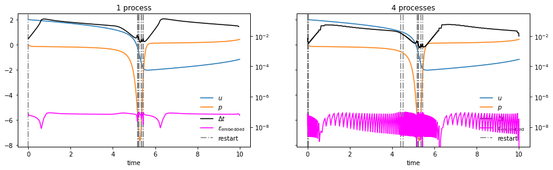

Adaptivity in block Gauss-Seidel SDC
------------------------------------

Adaptivity is a scheme for dynamically selecting the optimal step size
to solve a problem to a specified accuracy. The idea is to estimate the
error and then choose a step size for the next step to reach the
tolerance as best as possible.

Estimating the error
~~~~~~~~~~~~~~~~~~~~

Embedded method in time-serial
^^^^^^^^^^^^^^^^^^^^^^^^^^^^^^

The easiest thing to do is an embedded method, where two solutions
computed to different order of accuracy are subtracted:

.. math:: \epsilon = \|u^\left(k-1\right)-u^\left(k\right)\| = \|u^\left(k-1\right)-u^*-u^\left(k\right)+u^*\| = e^\left(k-1\right) + \mathcal{O}\left(\Delta t^{k+1}\right),

where the superscript in brackets denotes the order of the quantity and
:math:`u` and :math:`u^*` are the solution and exact solution. :math:`e`
is the error and :math:`\epsilon` is the estimate. As you can see, this
estimates the error of the lower order method. A particularly nice thing
is that with SDC the order is equal to the iteration count, so the order
:math:`k` is interchangable with the iteration number in the previous
equation. Notice that you are estimating the local error, meaning the
error introduced in this particular step here, since both solutions come
from the same initial conditions, which are considered “exact”.

Embedded method in time-parallel
^^^^^^^^^^^^^^^^^^^^^^^^^^^^^^^^

Block Gauss-Seidel SDC is equivalent to solving the entire block
completely with a first order method, then a second order method and so
on. This means that, unlike in the time-serial scheme, the second to
last sweep will never see the result of the last sweep of the previous
step. Now, if you do the same thing as before, you get a sort of
semi-global error within the block. To get the local error, which we
want to plug into adaptivity, we subtract two consecutive values of this
semi-global error. Let’s illustrate this using the advection problem.

.. code:: ipython3

    # script to run a simple advection problem
    import numpy as np
    
    from pySDC.helpers.stats_helper import get_sorted
    from pySDC.implementations.collocation_classes.gauss_radau_right import CollGaussRadau_Right
    from pySDC.implementations.problem_classes.AdvectionEquation_1D_FD import advection1d
    from pySDC.implementations.sweeper_classes.generic_implicit import generic_implicit
    from pySDC.implementations.controller_classes.controller_nonMPI import controller_nonMPI
    from pySDC.core.Hooks import hooks
    
    
    class log_data(hooks):
    
        def post_step(self, step, level_number):
    
            super(log_data, self).post_step(step, level_number)
    
            # some abbreviations
            L = step.levels[level_number]
    
            L.sweep.compute_end_point()
    
            self.add_to_stats(process=step.status.slot, time=L.time + L.dt, level=L.level_index, iter=0,
                              sweep=L.status.sweep, type='u', value=L.uend)
            self.add_to_stats(process=step.status.slot, time=L.time + L.dt, level=L.level_index, iter=0,
                              sweep=L.status.sweep, type='uold', value=L.uold[-1])
            self.add_to_stats(process=step.status.slot, time=L.time, level=L.level_index, iter=0,
                              sweep=L.status.sweep, type='dt', value=L.dt)
            self.add_to_stats(process=step.status.slot, time=L.time + L.dt, level=L.level_index, iter=0,
                              sweep=L.status.sweep, type='e_embedded', value=L.status.error_embedded_estimate)
            self.add_to_stats(process=step.status.slot, time=L.time + L.dt, level=L.level_index, iter=0,
                              sweep=L.status.sweep, type='e_extrapolated', value=L.status.error_extrapolation_estimate)
    
    
    def run_advection(num_procs):
        
        # initialize level parameters
        level_params = dict()
        level_params['dt'] = 0.05
        level_params['e_tol'] = 1e-8
    
        # initialize sweeper parameters
        sweeper_params = dict()
        sweeper_params['collocation_class'] = CollGaussRadau_Right
        sweeper_params['num_nodes'] = 3
        sweeper_params['QI'] = 'IE'  # For the IMEX sweeper, the LU-trick can be activated for the implicit part
        sweeper_params['QE'] = 'PIC'
    
        problem_params = {
            'freq': 2,
            'nvars': 2**9,
            'c': 1.,
            'type': 'upwind',
            'order': 5
        }
    
        # initialize step parameters
        step_params = dict()
        step_params['maxiter'] = 5
    
        # initialize controller parameters
        controller_params = dict()
        controller_params['logger_level'] = 30
        controller_params['hook_class'] = log_data
        controller_params['use_HotRod'] = False
        controller_params['use_adaptivity'] = True
        controller_params['mssdc_jac'] = False
    
        # fill description dictionary for easy step instantiation
        description = dict()
        description['problem_class'] = advection1d  # pass problem class
        description['problem_params'] = problem_params  # pass problem parameters
        description['sweeper_class'] = generic_implicit  # pass sweeper
        description['sweeper_params'] = sweeper_params  # pass sweeper parameters
        description['level_params'] = level_params  # pass level parameters
        description['step_params'] = step_params
    
        # set time parameters
        t0 = 0.0
        Tend = 2e-1
    
        # instantiate controller
        controller_class = controller_nonMPI
        controller = controller_class(num_procs=num_procs, controller_params=controller_params,
                                      description=description)
    
        # get initial values on finest level
        P = controller.MS[0].levels[0].prob
        uinit = P.u_exact(t0)
    
        # call main function to get things done...
        uend, stats = controller.run(u0=uinit, t0=t0, Tend=Tend)
        return stats

.. parsed-literal::

    /var/folders/zl/pxyz2x2x591c234cc02rcn_40000gn/T/ipykernel_4065/1082167617.py:5: DeprecationWarning: This import is deprecated and will be removed in future versions.To use this type of collocation, please use the new generic Collocation class in pySDC.implementations.collocations, for example:
    coll = Collocation(num_nodes, tleft, tright, node_type='LEGENDRE', quadType='RADAU-RIGHT')
    
      from pySDC.implementations.collocation_classes.gauss_radau_right import CollGaussRadau_Right

.. code:: ipython3

    # script to plot the embedded error
    import matplotlib.pyplot as plt
    
    
    def plot_embedded(stats, ax):
        u = get_sorted(stats, type='u', recomputed=False)
        uold = get_sorted(stats, type='uold', recomputed=False)
        t = [get_sorted(stats, type='u', recomputed=False)[i][0] for i in range(len(u))]
        e_em = np.array(get_sorted(stats, type='e_embedded', recomputed=False))[:, 1]
        e_em_semi_glob = [abs(u[i][1] - uold[i][1]) for i in range(len(u))]
        ax.plot(t, e_em_semi_glob, label=r'$\|u^{\left(k-1\right)}-u^{\left(k\right)}\|$')
        ax.plot(t, e_em, linestyle='--', label=r'$\epsilon$')
        ax.set_xlabel(r'$t$')
        ax.legend(frameon=False)

.. code:: ipython3

    fig, axs = plt.subplots(1, 2, figsize=(12, 4), sharex=True, sharey=True)
    plot_embedded(run_advection(1), axs[0])
    plot_embedded(run_advection(4), axs[1])
    axs[0].set_title('1 process')
    axs[1].set_title('4 processes')
    fig.tight_layout()
    plt.show()

.. image:: Adaptivity_files/Adaptivity_3_0.png

What do we see here? Both panels show the difference of the solutions as
well as the embedded error estimates, but for different processor
counts. In the left panel, we get the local error right from the
difference of the two sweeps, but in the right plot, we need to take the
difference between successive steps within a block to get the local
error. Now it does not agree with the serial estimate perfectly, but my
feeling is that it’s close enough for our purposes.

Adaptivity
~~~~~~~~~~

Adaptivity is based on the following equation:

.. math:: \frac{e_{n+1}}{e_n} = \left(\frac{h_{n+1}}{h_n}\right)^{k+1},

with :math:`n` the index of the time step, :math:`e` the local errors,
:math:`h` the step sizes and :math:`k` the order of the time marching
scheme (:math:`k+1` since the error is one higher than the order of
accuracy). This can be rearranged and manipulated to give

.. math:: h_{n+1} = \beta h_n \left(\frac{\epsilon_\mathrm{tol}}{\epsilon_{n}}\right)^{1/k}.

A couple of things happened here: First, we replaced the error of the
next step by the tolerance that we set, which is what we want it to be.
Then, we put in the estimate of the error of the second to last sweep,
so the exponent drops by one and we get :math:`1/k` instead of
:math:`1/(k+1)` in the exponent here. Finally, we introduced a safety
factor :math:`\beta=0.9` to avoid too many restarts.

These equations are based on the idea of time marching schemes having an
order of accuracy, but it is not really valid for consecutive steps, but
only for the same step, as the time scale may change between steps. Not
to worry, though because whenever we do not reach the desired accuracy,
we just restart the step and compare two solutions of the same step with
different sizes such that we should arrive at a good step size after one
restart (in serial at least).

In serial, applying this scheme is super easy, but in parallel the
question is: How do we use the step size computed with adaptivity, when
we are already :math:`k-1` iterations into the step in question, after
computing a step size for it? The easiest answer seems to be to treat
the problem in the block structure that is inherent to block
Gauss-Seidel, and to have the all steps in a block have the same step
size.

To get a bit more precise about what I mean by block: Each step is a
collocation problem with :math:`M` nodes and each block contains
:math:`N` steps, such that a block of steps contains :math:`N\times M`
collocation nodes.

Let’s demonstrate how a step size distribution using adaptivity looks in
the van der Pol problem.

.. code:: ipython3

    # script to run a van der Pol problem
    import numpy as np
    
    from pySDC.helpers.stats_helper import get_sorted
    from pySDC.implementations.collocation_classes.gauss_radau_right import CollGaussRadau_Right
    from pySDC.implementations.problem_classes.Van_der_Pol_implicit import vanderpol
    from pySDC.implementations.sweeper_classes.generic_implicit import generic_implicit
    from pySDC.implementations.controller_classes.controller_nonMPI import controller_nonMPI
    from pySDC.core.Hooks import hooks
    
    
    class log_data(hooks):
    
        def post_step(self, step, level_number):
    
            super(log_data, self).post_step(step, level_number)
    
            # some abbreviations
            L = step.levels[level_number]
    
            L.sweep.compute_end_point()
    
            self.add_to_stats(process=step.status.slot, time=L.time + L.dt, level=L.level_index, iter=0,
                              sweep=L.status.sweep, type='u', value=L.uend[0])
            self.add_to_stats(process=step.status.slot, time=L.time + L.dt, level=L.level_index, iter=0,
                              sweep=L.status.sweep, type='p', value=L.uend[1])
            self.add_to_stats(process=step.status.slot, time=L.time, level=L.level_index, iter=0,
                              sweep=L.status.sweep, type='dt', value=L.dt)
            self.add_to_stats(process=step.status.slot, time=L.time + L.dt, level=L.level_index, iter=0,
                              sweep=L.status.sweep, type='e_em', value=L.status.error_embedded_estimate)
            self.add_to_stats(process=step.status.slot, time=L.time + L.dt, level=L.level_index, iter=0,
                              sweep=L.status.sweep, type='e_ex', value=L.status.error_extrapolation_estimate)
            self.increment_stats(process=step.status.slot, time=L.time, level=L.level_index, iter=0,
                                 sweep=L.status.sweep, type='restart', value=int(step.status.restart))
    
    
    def run_vdp(num_procs, use_adaptivity):
    
        # initialize level parameters
        level_params = dict()
        level_params['dt'] = 1e-2
        level_params['e_tol'] = 1e-7
    
        # initialize sweeper parameters
        sweeper_params = dict()
        sweeper_params['collocation_class'] = CollGaussRadau_Right
        sweeper_params['num_nodes'] = 3
        sweeper_params['QI'] = 'LU'
    
        problem_params = {
            'mu': 5.,
            'newton_tol': 1e-9,
            'newton_maxiter': 99,
            'u0': np.array([2.0, 0.]),
        }
    
        # initialize step parameters
        step_params = dict()
        step_params['maxiter'] = 4
    
        # initialize controller parameters
        controller_params = dict()
        controller_params['logger_level'] = 30
        controller_params['hook_class'] = log_data
        controller_params['use_adaptivity'] = use_adaptivity
        controller_params['mssdc_jac'] = False
        controller_params['force_reach_Tend'] = True
    
        # fill description dictionary for easy step instantiation
        description = dict()
        description['problem_class'] = vanderpol  # pass problem class
        description['problem_params'] = problem_params  # pass problem parameters
        description['sweeper_class'] = generic_implicit  # pass sweeper
        description['sweeper_params'] = sweeper_params  # pass sweeper parameters
        description['level_params'] = level_params  # pass level parameters
        description['step_params'] = step_params
    
        # set time parameters
        t0 = 0.0
        Tend = 1e1
    
        # instantiate controller
        controller = controller_nonMPI(num_procs=num_procs, controller_params=controller_params,
                                       description=description)
    
        # get initial values on finest level
        P = controller.MS[0].levels[0].prob
        uinit = P.u_exact(t0)
    
        # call main function to get things done...
        uend, stats = controller.run(u0=uinit, t0=t0, Tend=Tend)
    
        return stats

.. code:: ipython3

    # script to plot some quantities relating to adaptivity in van der Pol
    import matplotlib.pyplot as plt
    
    
    def plot_step_sizes(stats, ax):
    
        # convert filtered statistics to list of iterations count, sorted by process
        u = np.array(get_sorted(stats, type='u', recomputed=False, sortby='time'))[:, 1]
        p = np.array(get_sorted(stats, type='p', recomputed=False, sortby='time'))[:, 1]
        t = np.array(get_sorted(stats, type='p', recomputed=False, sortby='time'))[:, 0]
    
        e_em = np.array(get_sorted(stats, type='e_em', recomputed=False, sortby='time'))[:, 1]
        dt = np.array(get_sorted(stats, type='dt', recomputed=False, sortby='time'))
        restart = np.array(get_sorted(stats, type='restart', recomputed=None, sortby='time'))
    
        ax.plot(t, u, label=r'$u$')
        ax.plot(t, p, label=r'$p$')
    
        dt_ax = ax.twinx()
        dt_ax.plot(dt[:, 0], dt[:, 1], color='black')
        dt_ax.plot(t, e_em, color='magenta')
        dt_ax.set_yscale('log')
        dt_ax.set_ylim((5e-10, 3e-1))
    
        ax.plot([None], [None], label=r'$\Delta t$', color='black')
        ax.plot([None], [None], label=r'$\epsilon_\mathrm{embedded}$', color='magenta')
        ax.plot([None], [None], label='restart', color='grey', ls='-.')
    
        for i in range(len(restart)):
            if restart[i, 1] > 0:
                ax.axvline(restart[i, 0], color='grey', ls='-.')
        ax.legend(frameon=False)
    
        ax.set_xlabel('time')

.. code:: ipython3

    fig, axs = plt.subplots(1, 2, figsize=(15, 4), sharex=True, sharey=True)
    plot_step_sizes(run_vdp(1, True), axs[0])
    plot_step_sizes(run_vdp(4, True), axs[1])
    axs[0].set_title('1 process')
    axs[1].set_title('4 processes')
    plt.show()

The two components of the solution :math:`u` and :math:`p` are plotted
in linear scale on the left axis, while step size and embedded error
estimate are plotted on the log scale on the right axis. The embedded
error is supposed to stay below a threshold of :math:`10^{-7}` and it
does, but it wobbles about quite a bit when using multiple processes,
owing to the non-linearity of this equation.

The details of the PinT extension go like this: We solve the entire
block as usual with the same step size accross all steps in the block.
Then, we estimate the local error, check if the accuracy was reached and
compute new step sizes, without distributing them to any steps just yet.
Now, we look at the whole block to see which was the first step not to
reach the accuracy we want or if they all did. This let’s us decide
whether to start the new block from the solution to the last step of the
current block or with the initial conditions of the first step that
triggers a restart. Finally, we give each step the step size computed
with adaptivity on the same step that we use for initial conditions of
the next block and then we start the next block.

The result is the staircase pattern in the step sizes in the right
panel. A better scheme would allow to give the steps different step
sizes, but that’s not straightforward, since extrapolation of step sizes
for instance is dangerous business in the world of non-linear equations.
But I will make an attempt at finding someting better in the future.

How can you use adaptivity with pySDC?
^^^^^^^^^^^^^^^^^^^^^^^^^^^^^^^^^^^^^^

It really is very simple. As you can gather from the equations above, we
do not introduce many more parameters, but we replace the time step by a
tolerance. You should still put in a time step size, because that will
be the starting guess, so it would ideally be close to what you want the
step size to be. Then you change the following parameters in the
``description`` object, just like in the above examples:

::

   step_params['e_tol'] = <tolerance>
   controler_params['use_adaptivity'] = True

You also need to make sure you satisfy the assumptions that went into
this implementation of adaptivity, which is mainly that you know the
order and that it is fixed. Please set the residual tolerance to 0 or
smaller to make sure you always perform the same amount of iterations:

::

   level_params['restol'] = -1.

It is initialized to 0, so if you don’t explicitly set a value, that
will be fine for most cases. Then you need to set an appropriate value
for the iteration number and collocation nodes:

::

   step_params['maxiter'] = <your iteration count>
   sweeper_params['num_nodes'] = <sufficient number of nodes>

The number of iterations must be at least two for the embedded method to
give something sensible and should probably not exceed 6 or so, just see
if the step sizes are sensible at the order you choose. There is no
one-size-fits-all recipe here.

Also, choose your preconditioner wisely! The order should rise by one
with each sweep when using implicit euler, but it turns out the same
thing happens when using LU in some cases, which is why we use that in
this example, but make sure your preconditioner leads to the correct
order with your particular problem!

When doing PinT, adaptivity is only implemented in block Gauss-Seidel
mode, so you need to set

::

   controller_params['mssdc_jac'] = False

To monitor the restarts simply put the following in the ``post_step``
hook:

::

   self.increment_stats(process=step.status.slot, time=L.time, level=L.level_index, iter=0,
                        sweep=L.status.sweep, type='restart', value=int(step.status.restart))

The increment stats function allows to count when the same step has been
restarted multiple times. To filter out any unwanted values when doing
PinT that have been recorded but then restarted and not overridden
because the step sizes are now different, use the ``recomputed=False``
attribute in the functions on the stats object, which uses the same
``steps.status.restart`` variable which is recorded in each
``post_step`` hook by default.

Finally, care must be taken with the time that is associated with the
solutions. Usually, I see ``post_step`` hooks recording the solution of
the step at time ``L.t``, which is the beginning of the step, but what
is acutally recorded is the solution at the end of the step. With fixed
step sizes, this is a constant offset that doesn’t matter much, but with
adaptive step sizes, especially when there is a big jump, this mismatch
will show up as wobbles or kinks in plots. But don’t dispair! This is
entirely a plotting artifact that you can get rid of by chosing
``time=L.time + L.dt`` as the time when you record the solution in the
hook. Of course, you can still choose to attribute the step size to the
beginning of the step for instance and record different quantities at
different times in the same hook.
