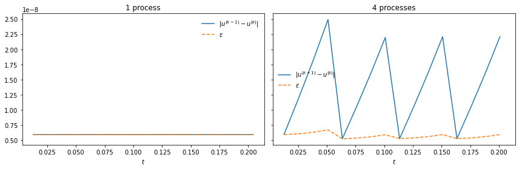

Adaptivity in block Gauss-Seidel SDC
====================================

Adaptivity is a scheme for dynamically selecting the optimal step size
to solve a problem to a specified accuracy. The idea is to estimate the
error and then choose a step size for the next step to reach the
tolerance as best as possible.

Estimating the error
--------------------

Embedded method in time-serial
~~~~~~~~~~~~~~~~~~~~~~~~~~~~~~

The easiest thing to do is an embedded method, where two solutions
computed to different accuracy are subracted:

.. math:: \epsilon = \|u^\left(k-1\right)-u^\left(k\right)\| = \|u^\left(k-1\right)-u^*-u^\left(k\right)+u^*\| = e^\left(k-1\right) + \mathcal{O}\left(\Delta t^{k+1}\right),

where the superscript in brackets denotes the order of the quantity and
:math:`u` and :math:`u^*` are the solution and exact solution. :math:`e`
is the error and :math:`\epsilon` is the estimate. As you can see, this
estimates the error of the lower order method. A particularly nice thing
is that with SDC the order is equal to the iteration count, so the order
:math:`k` is interchangable with the iteration number in the previous
equation. Notice that you are estimating the local error here since both
solutions come from the same initial conditions, which are considered
“exact”.

Embedded method in time-parallel
~~~~~~~~~~~~~~~~~~~~~~~~~~~~~~~~

Block Gauss-Seidel SDC is equivalent to solving the entire block
completely with a first order method, then a second order method and so
on. This means that, unlike in the time-serial scheme, the second to
last sweep will never see the result of the last sweep of the previous
step. Now, if you do the same thing as before, you get a sort of semi
global error within the block. To get the local error, which we want to
plug into adaptivity, we subtract two consecutive values of this
semi-global error. Let’s illustrate this using the advection problem.

.. code:: ipython3

    import numpy as np
    import matplotlib.pyplot as plt
    
    from pySDC.helpers.stats_helper import get_sorted
    from pySDC.implementations.collocation_classes.gauss_radau_right import CollGaussRadau_Right
    from pySDC.implementations.problem_classes.AdvectionEquation_1D_FD import advection1d
    from pySDC.implementations.sweeper_classes.generic_implicit import generic_implicit
    from pySDC.implementations.controller_classes.controller_nonMPI import controller_nonMPI
    
    from pySDC.core.Hooks import hooks
    
    class log_data(hooks):
    
        def post_step(self, step, level_number):
    
            super(log_data, self).post_step(step, level_number)
    
            # some abbreviations
            L = step.levels[level_number]
    
            L.sweep.compute_end_point()
    
            self.add_to_stats(process=step.status.slot, time=L.time + L.dt, level=L.level_index, iter=0,
                              sweep=L.status.sweep, type='u', value=L.uend)
            self.add_to_stats(process=step.status.slot, time=L.time + L.dt, level=L.level_index, iter=0,
                              sweep=L.status.sweep, type='uold', value=L.uold[-1])
            self.add_to_stats(process=step.status.slot, time=L.time, level=L.level_index, iter=0,
                              sweep=L.status.sweep, type='dt', value=L.dt)
            self.add_to_stats(process=step.status.slot, time=L.time + L.dt, level=L.level_index, iter=0,
                              sweep=L.status.sweep, type='e_embedded', value=L.status.error_embedded_estimate)
            self.add_to_stats(process=step.status.slot, time=L.time + L.dt, level=L.level_index, iter=0,
                              sweep=L.status.sweep, type='e_extrapolated', value=L.status.error_extrapolation_estimate)
    
    
    def run(num_procs):
        """
        A simple test program to do PFASST runs for the heat equation
        """
    
        # initialize level parameters
        level_params = dict()
        level_params['dt'] = 0.05
        level_params['e_tol'] = 1e-8
    
        # initialize sweeper parameters
        sweeper_params = dict()
        sweeper_params['collocation_class'] = CollGaussRadau_Right
        sweeper_params['num_nodes'] = 3
        sweeper_params['QI'] = 'IE'  # For the IMEX sweeper, the LU-trick can be activated for the implicit part
        sweeper_params['QE'] = 'PIC'
    
        problem_params = {
            'freq': 2,
            'nvars': 2**9,
            'c': 1.,
            'type': 'upwind',
            'order': 5
        }
    
        # initialize step parameters
        step_params = dict()
        step_params['maxiter'] = 5
    
        # initialize controller parameters
        controller_params = dict()
        controller_params['logger_level'] = 30
        controller_params['hook_class'] = log_data
        controller_params['use_HotRod'] = False
        controller_params['use_adaptivity'] = True
        controller_params['mssdc_jac'] = False
    
        # fill description dictionary for easy step instantiation
        description = dict()
        description['problem_class'] = advection1d  # pass problem class
        description['problem_params'] = problem_params  # pass problem parameters
        description['sweeper_class'] = generic_implicit  # pass sweeper
        description['sweeper_params'] = sweeper_params  # pass sweeper parameters
        description['level_params'] = level_params  # pass level parameters
        description['step_params'] = step_params
    
        # set time parameters
        t0 = 0.0
        Tend = 2e-1
    
        # instantiate controller
        controller_class = controller_nonMPI
        controller = controller_class(num_procs=num_procs, controller_params=controller_params,
                                      description=description)
    
        # get initial values on finest level
        P = controller.MS[0].levels[0].prob
        uinit = P.u_exact(t0)
    
        # call main function to get things done...
        uend, stats = controller.run(u0=uinit, t0=t0, Tend=Tend)
        return stats

.. parsed-literal::

    /var/folders/zl/pxyz2x2x591c234cc02rcn_40000gn/T/ipykernel_29009/3180917860.py:5: DeprecationWarning: This import is deprecated and will be removed in future versions.To use this type of collocation, please use the new generic Collocation class in pySDC.implementations.collocations, for example:
    coll = Collocation(num_nodes, tleft, tright, node_type='LEGENDRE', quadType='RADAU-RIGHT')
    
      from pySDC.implementations.collocation_classes.gauss_radau_right import CollGaussRadau_Right

.. code:: ipython3

    def plot_embedded(stats, ax):
        u = get_sorted(stats, type='u', recomputed=False)
        uold = get_sorted(stats, type='uold', recomputed=False)
        t = [get_sorted(stats, type='u', recomputed=False)[i][0] for i in range(len(u))]
        e_em = np.array(get_sorted(stats, type='e_embedded', recomputed=False))[:,1]
        e_em_semi_glob = [abs(u[i][1]-uold[i][1]) for i in range(len(u))]
        ax.plot(t, e_em_semi_glob, label=r'$\|u^{\left(k-1\right)}-u^{\left(k\right)}\|$')
        ax.plot(t, e_em, linestyle='--', label=r'$\epsilon$')
        ax.set_xlabel(r'$t$')
        ax.legend(frameon=False)

.. code:: ipython3

    fig, axs = plt.subplots(1,2, figsize=(12, 4), sharex=True, sharey=True)
    plot_embedded(run(1), axs[0])
    plot_embedded(run(4), axs[1])
    axs[0].set_title('1 process')
    axs[1].set_title('4 processes')
    fig.tight_layout()
    plt.show()

What do we see here? Both panels show the difference of the solutions as
well as the embedded error estimates, but for different processor
counts. In the left panel, we get the local error right from the
difference of the two sweeps, but in the right plot, we need to take the
difference between successive steps within a block to get the local
error. Now it does not agree with the serial estimate perfectly, but my
feeling is that it’s close enough for our purposes

Adaptivity
----------

Adaptivity is based on the following equation:

.. math:: \frac{e_{n+1}}{e_n} = \left(\frac{h_{n+1}}{h_n}\right)^{k+1},

with :math:`n` the index of the time step

