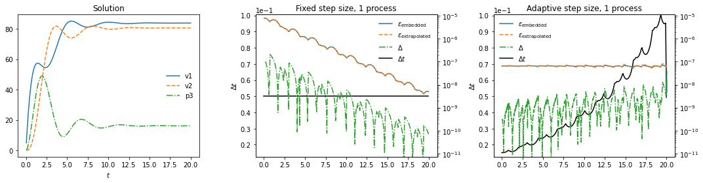
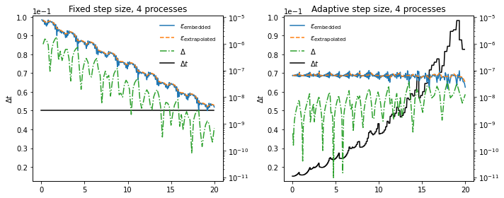

Hot Rod in block Gauss-Seidel SDC
---------------------------------

`Hot Rod <https://doi.org/10.1007/978-3-319-43659-3_47>`__ is a detector
for soft faults. It works by performing two error estimates, subtracting
them and comparing that to a threshold. The first error estimate is the
familiar embedded estimate (see the notes on adaptivity). The second one
is based on extrapolation.

Extrapolation based error estimate
~~~~~~~~~~~~~~~~~~~~~~~~~~~~~~~~~~

This idea is taken from `Butcher and
Johnston <https://doi.org/10.1016/0377-0427(93)90275-G>`__, who did this
with Runge-Kutta schemes. We combine values of the solution of previous
time steps to extrapolate to the end of the current time step, while at
the same time solving the current step as usual, which gives us two
solutions and by subtracting them, we can get the error.

Let’s start with how to do the extrapolation, which we will do with an
idea very close to finite differences. We do a Taylor expansion of the
solution around the point where we are trying to estimate the error,
:math:`t`:

.. math:: u(t-h) = u(t) - h u'(t) + \sum_{j=2}^n \frac{(-h)^j}{j!}u^{\left(j\right)}(t) + \mathcal{O}(h^{n+1}),

where the derivatives are in the time direction. Notice how the solution
appears only evaluated at time :math:`t` and the distance to :math:`t`
only appears in the summands of the expansion as a prefactor to some
power. This means we can combine evaluations of the solution at
different distances from the point around which we expand to get an
arbitrary derivative to arbitrary order, provided we have enough values
available. This is preciely the finite difference idea.

However, we are doing a few things slightly differently from the usual
finite difference computation. First of all, we are interested in the
solution itself, rather than a derivative, which is unnatural in the
context of spatial discretization that finite differences are usually
found in, but requires no conceptual change. The larger difference is
that we actually know the first derivative in time from evaluating the
right hand side of the problem. The derivative function is precisely
what we put in as the problem to solve!

What we want looks like this:

.. math:: u_{-1} = \sum_{j=2}^{n+1} a_j u_{-j} + b_j f_{-j} + \mathcal{O}\left(h^{n+2}\right),

where :math:`u_{-j}` and :math:`f_{-j}` are the solution and right hand
side evaluations of the step :math:`j-1` steps ago and the coefficients
:math:`a_j` and :math:`b_j` remain to be found. We will tackle this
problem by constructing a linear system :math:`Ax=y`, which can easily
be solved. The matrix :math:`A` will contain the coefficients in front
of the function evaluations in the Taylor expansion, where the row index
corresponds to the derivative and the colum index corresponds to a step.
The solution vector :math:`y` will carry a one in the row of the
derivative that we want to compute and the solution vector will carry
the coefficients :math:`a` and :math:`b`. We will Taylor expand until
the order that we want and we need just as many solutions or right hand
side evaluations to get a system that we can solve.

.. math::

   A_{ij} = 
   \begin{cases}
   \frac{h_{-j}^{i}}{i!},& i < \frac{n}{2}\\
   \frac{h_{-j}^i}{(i-1)!},& otherwise,
   \end{cases}

.. math:: b_i = \delta_{i1},

.. math:: a_j = x_j, b_j = x_{j+n/2}, a_1 = 1, b_1 = 0

.. math:: h_{-1} = 0.

Here, the left half of :math:`A` corresponds to the solutions and the
right half corresponds to the right hand side evaluations. Of course,
some care must be taken if :math:`n` is uneven, but it is not
conceptually difficult. In the implementation in pySDC, we choose to set
:math:`b_{-n/2}=0` to resolve this.

What do we put in for :math:`n` now? We want to estimate the local
error, which is order :math:`k+1`, so we set :math:`n=k+2` to make sure
the error introduced by the Taylor expansion is negligible compared to
the error of time marching, which we want to estimate.

Now we have two solutions at the end of the current step, one computed
by extrapolation and the other one by the time marching scheme. If we
subtract the two, we get only the local error, but since they carry
multiples of the local error, we need to fix a prefactor before we
really get the local error. Putting initial conditions into the time
marching scheme produces the solution plus one times the local error,
but the extrapolation method is based on multiple instances of
time-marching-scheme produced solutions and their errors accumulate. In
a linear equation the error would just sum up: The solution after three
steps comes with three times the local error, but we have two
complications. The first one is adaptivity: With changing step size, the
local error introduced while solving each step is different and the
second one is non-linearity of equations. For non-linear equations,
there is really not much we can do. The prefactor will be slightly off.
But for adaptivity, we can provide a kind of fix, which only works when
the time scale of the problem doesn’t change quickly, which is the
following:

.. math:: e_{-j}\approx \left(\frac{h_{-1}}{h_{-j}}\right)^{k+1}e_{-1}.

Keep in mind that in our weird notation :math:`e_{-1}` is the local
error of the current step. We can then compute the prefactor as

.. math:: \mathcal{P} = 1/\mid \sum_{j=1}^{n+1} \left(\sum_{i=1}^{n-j} \left(\frac{h_{-i}}{h_{-1}}\right)^{k+1}\right) a_j - 1\mid,

where the inner sum is the accumulated error carried by each solution
and the outer sum gathers the contributions of all participating
solutions as they enter in the extrapolation. The :math:`-1` is for the
contribution of the solution obtained by time marching.

Now, we have all we need:

.. math:: \epsilon_{extrapolation} = \mathcal{P}\left(\sum_{j=2}^{n+1} a_j u_{-j} + b_j f_{-j} - u_{-1}\right)

And now we have an estimate for the local error that is based on
something else than the embedded method, so we can compare. But this
method has several complicating aspects. First of all, we introduce
severe memory overhead, since we don’t just need the solution in memory,
but additional quantities that total :math:`k+1` times the size in
memory as the solution. Second, we already mentioned that with
non-linear equations, this method looses some accuracy because the
underlying ideas in computing the prefactor are only valid for linear
equations. Finally, we estimate here the error of the last sweep, which
is good, but if we want to compare to the error of the second to last
sweep that we get from the embedded method, it turns out we actually
need to advance in time with the second to last sweep as well. Just
storing the second to last sweep for extrapolation and advancing with
the last sweep has yielded an error estimate of the order of the last
sweep, so this is not a valid solution. This means, however, that on top
of the significant memory overhead, we now also get significant
computational overhead since we need to perform an extra sweep which we
then throw away.

Hot Rod resilience strategy
~~~~~~~~~~~~~~~~~~~~~~~~~~~

As discussed in the above paragraph, Hot Rod is not without its flaws,
but we can actually construct a rather resilient fault detector from
this. We now take the difference of the two error estimates that we
obtained and this should be one order higher than the estimates
themselves:

.. math:: \Delta = \|\epsilon_\mathrm{embedded} - \epsilon_\mathrm{extrapolation}\| = \|e + \mathcal{O}\left(h^{k+1}\right) - e + \mathcal{O}\left(h^{k+1}\right)\| = \mathcal{O}\left(h^{k+1}\right).

Now it’s as simple as comparing this to a threshold and restarting
whenever this threshold is exceeded.

Tests
~~~~~

We will look at the Pi-line problem here, which models an electrical
startup process and is a simple but not too boring equation. Let’s run
this and look at what the error estimates give us:

.. code:: ipython3

    # script to run a Piline problem
    import numpy as np
    import matplotlib.pyplot as plt
    
    from pySDC.helpers.stats_helper import filter_stats, sort_stats
    from pySDC.implementations.collocation_classes.gauss_radau_right import CollGaussRadau_Right
    from pySDC.implementations.problem_classes.Piline import piline
    from pySDC.implementations.sweeper_classes.imex_1st_order import imex_1st_order
    from pySDC.implementations.controller_classes.controller_nonMPI import controller_nonMPI
    from pySDC.core.Hooks import hooks
    
    
    class log_data(hooks):
    
        def post_step(self, step, level_number):
    
            super(log_data, self).post_step(step, level_number)
    
            # some abbreviations
            L = step.levels[level_number]
    
            L.sweep.compute_end_point()
    
            self.add_to_stats(process=step.status.slot, time=L.time + L.dt, level=L.level_index, iter=0,
                              sweep=L.status.sweep, type='v1', value=L.uend[0])
            self.add_to_stats(process=step.status.slot, time=L.time + L.dt, level=L.level_index, iter=0,
                              sweep=L.status.sweep, type='v2', value=L.uend[1])
            self.add_to_stats(process=step.status.slot, time=L.time + L.dt, level=L.level_index, iter=0,
                              sweep=L.status.sweep, type='p3', value=L.uend[2])
            self.add_to_stats(process=step.status.slot, time=L.time, level=L.level_index, iter=0,
                              sweep=L.status.sweep, type='dt', value=L.dt)
            self.add_to_stats(process=step.status.slot, time=L.time + L.dt, level=L.level_index, iter=0,
                              sweep=L.status.sweep, type='e_embedded', value=L.status.error_embedded_estimate)
            self.add_to_stats(process=step.status.slot, time=L.time + L.dt, level=L.level_index, iter=0,
                              sweep=L.status.sweep, type='e_extrapolated', value=L.status.error_extrapolation_estimate)
            self.increment_stats(process=step.status.slot, time=L.time, level=L.level_index, iter=0,
                                 sweep=L.status.sweep, type='restart', value=int(step.status.restart))
            self.increment_stats(process=step.status.slot, time=L.time, level=L.level_index, iter=0,
                                 sweep=L.status.sweep, type='sweeps', value=step.status.iter)
    
    
    def run_piline(use_adaptivity, num_procs):
        """
        A simple test program to do PFASST runs for the heat equation
        """
    
        # initialize level parameters
        level_params = dict()
        level_params['dt'] = 5e-2
        level_params['e_tol'] = 1e-7
    
        # initialize sweeper parameters
        sweeper_params = dict()
        sweeper_params['collocation_class'] = CollGaussRadau_Right
        sweeper_params['num_nodes'] = 3
        sweeper_params['QI'] = 'IE'
        sweeper_params['QE'] = 'PIC'
    
        problem_params = {
            'Vs': 100.,
            'Rs': 1.,
            'C1': 1.,
            'Rpi': 0.2,
            'C2': 1.,
            'Lpi': 1.,
            'Rl': 5.,
        }
    
        # initialize step parameters
        step_params = dict()
        step_params['maxiter'] = 4
    
        # initialize controller parameters
        controller_params = dict()
        controller_params['logger_level'] = 30
        controller_params['hook_class'] = log_data
        controller_params['use_HotRod'] = True
        controller_params['use_adaptivity'] = use_adaptivity
        controller_params['mssdc_jac'] = False
        controller_params['HotRod_tol'] = 1e-3
    
        # fill description dictionary for easy step instantiation
        description = dict()
        description['problem_class'] = piline  # pass problem class
        description['problem_params'] = problem_params  # pass problem parameters
        description['sweeper_class'] = imex_1st_order  # pass sweeper
        description['sweeper_params'] = sweeper_params  # pass sweeper parameters
        description['level_params'] = level_params  # pass level parameters
        description['step_params'] = step_params
    
        # set time parameters
        t0 = 0.0
        Tend = 2e+1
    
        # instantiate controller
        controller_class = controller_nonMPI
        controller = controller_class(num_procs=num_procs, controller_params=controller_params,
                                      description=description)
    
        # get initial values on finest level
        P = controller.MS[0].levels[0].prob
        uinit = P.u_exact(t0)
    
        # call main function to get things done...
        uend, stats = controller.run(u0=uinit, t0=t0, Tend=Tend)
        return stats

.. parsed-literal::

    /var/folders/zl/pxyz2x2x591c234cc02rcn_40000gn/T/ipykernel_4081/1779453228.py:6: DeprecationWarning: This import is deprecated and will be removed in future versions.To use this type of collocation, please use the new generic Collocation class in pySDC.implementations.collocations, for example:
    coll = Collocation(num_nodes, tleft, tright, node_type='LEGENDRE', quadType='RADAU-RIGHT')
    
      from pySDC.implementations.collocation_classes.gauss_radau_right import CollGaussRadau_Right

.. code:: ipython3

    # script to plot some quantities and compare to reference values
    def plot_solution(stats, ax):
        recomputed = False
        v1 = np.array(sort_stats(filter_stats(stats, type='v1', recomputed=recomputed), sortby='time'))[:, 1]
        v2 = np.array(sort_stats(filter_stats(stats, type='v2', recomputed=recomputed), sortby='time'))[:, 1]
        p3 = np.array(sort_stats(filter_stats(stats, type='p3', recomputed=recomputed), sortby='time'))[:, 1]
        t = np.array(sort_stats(filter_stats(stats, type='p3', recomputed=recomputed), sortby='time'))[:, 0]
        
        ax.plot(t, v1, label='v1', ls='-')
        ax.plot(t, v2, label='v2', ls='--')
        ax.plot(t, p3, label='p3', ls='-.')
        ax.legend(frameon=False)
        ax.set_xlabel(r'$t$')
    
        
    def plot_and_test(stats, use_adaptivity, num_procs, generate_reference=False, ax=None):
        recomputed = False
    
        # read quantities from a simulation
        v1 = np.array(sort_stats(filter_stats(stats, type='v1', recomputed=recomputed), sortby='time'))[:, 1]
        v2 = np.array(sort_stats(filter_stats(stats, type='v2', recomputed=recomputed), sortby='time'))[:, 1]
        p3 = np.array(sort_stats(filter_stats(stats, type='p3', recomputed=recomputed), sortby='time'))[:, 1]
        t = np.array(sort_stats(filter_stats(stats, type='p3', recomputed=recomputed), sortby='time'))[:, 0]
        dt = np.array(sort_stats(filter_stats(stats, type='dt', recomputed=recomputed), sortby='time'))
        e_em = np.array(sort_stats(filter_stats(stats, type='e_embedded', recomputed=recomputed), sortby='time'))[:, 1]
        e_ex = np.array(sort_stats(filter_stats(stats, type='e_extrapolated', recomputed=recomputed), sortby='time'))[:, 1]
        restarts = np.array(sort_stats(filter_stats(stats, type='restart', recomputed=recomputed), sortby='time'))[:, 1]
        sweeps = np.array(sort_stats(filter_stats(stats, type='sweeps', recomputed=recomputed), sortby='time'))[:, 1]
        ready = np.logical_and(e_ex != np.array(None), e_em != np.array(None))
        restarts = np.array(sort_stats(filter_stats(stats, type='restart', recomputed=recomputed), sortby='time'))[:, 1]
    
        # reference quantities
        if use_adaptivity and num_procs == 1:
            error_msg = 'Error when using adaptivity in serial:'
            expected = {
                'v1': 83.88330442715265,
                'v2': 80.62692930055763,
                'p3': 16.13594155613822,
                'e_em': 4.922608098922865e-09,
                'e_ex': 4.4120077421613226e-08,
                'dt': 0.05,
                'restarts': 1.0,
                'sweeps': 2416.0,
                't': 20.03656747407325,
            }
    
        elif use_adaptivity and num_procs == 4:
            error_msg = 'Error when using adaptivity in parallel:'
            expected = {
                'v1': 83.88400082289273,
                'v2': 80.62656229801286,
                'p3': 16.134850400599763,
                'e_em': 2.3681899108396465e-08,
                'e_ex': 3.6491178375304526e-08,
                'dt': 0.08265581329617167,
                'restarts': 12.0,
                'sweeps': 2432.0,
                't': 19.999999999999996,
            }
    
        elif not use_adaptivity and num_procs == 4:
            error_msg = 'Error with fixed step size in parallel:'
            expected = {
                'v1': 83.88400128006428,
                'v2': 80.62656202423844,
                'p3': 16.134849781053525,
                'e_em': 4.277040943634347e-09,
                'e_ex': 4.9707053288253756e-09,
                'dt': 0.05,
                'restarts': 0.0,
                'sweeps': 1600.0,
                't': 20.00000000000015,
            }
    
        elif not use_adaptivity and num_procs == 1:
            error_msg = 'Error with fixed step size in serial:'
            expected = {
                'v1': 83.88400149770143,
                'v2': 80.62656173487008,
                'p3': 16.134849851184736,
                'e_em': 4.977994905175365e-09,
                'e_ex': 5.048084913047097e-09,
                'dt': 0.05,
                'restarts': 0.0,
                'sweeps': 1600.0,
                't': 20.00000000000015,
            }
    
        got = {
            'v1': v1[-1],
            'v2': v2[-1],
            'p3': p3[-1],
            'e_em': e_em[-1],
            'e_ex': e_ex[e_ex != [None]][-1],
            'dt': dt[-1][1],
            'restarts': restarts.sum(),
            'sweeps': sweeps.sum(),
            't': t[-1],
        }
    
        if generate_reference:
            print(f'Adaptivity: {use_adaptivity}, num_procs={num_procs}')
            print('expected = {')
            for k in got.keys():
                v = got[k]
                if type(v) in [list, np.ndarray]:
                    print(f'    \'{k}\': {v[v!=[None]][-1]},')
                else:
                    print(f'    \'{k}\': {v},')
            print('}')
    
        
        ax.plot(dt[:, 0], dt[:, 1], color='black')
        ax.ticklabel_format(axis='y', style='sci', scilimits=(-2, -3))
        ax.set_ylim((0.012574322653781072, 0.10050387672423527))
    
        e_ax = ax.twinx()
        e_ax.plot(t, e_em, label=r'$\epsilon_\mathrm{embedded}$')
        e_ax.plot(t[ready], e_ex[ready], label=r'$\epsilon_\mathrm{extrapolated}$', ls='--')
        e_ax.plot(t[ready], abs(e_em[ready] - e_ex[ready]), label=r'$\Delta$', ls='-.')
        e_ax.plot([None, None], label=r'$\Delta t$', color='black')
        e_ax.set_yscale('log')
        if use_adaptivity:
            e_ax.legend(frameon=False, loc='upper left')
        else:
            e_ax.legend(frameon=False, loc='upper right')
        e_ax.set_ylim((7.367539795147197e-12, 1.109667868425781e-05))
    
        ax.set_ylabel(r'$\Delta t$')
    
        for k in expected.keys():
            assert np.isclose(expected[k], got[k], rtol=1e-3),\
                   f'{error_msg} Expected {k}={expected[k]:.2e}, got {k}={got[k]:.2e}'

.. code:: ipython3

    fig, axs = plt.subplots(1, 3, figsize=(15, 4), sharex=True)
    stats = run_piline(False, 1)
    plot_solution(stats, axs[0])
    axs[0].set_title('Solution')
    plot_and_test(stats, False, 1, ax=axs[1])
    axs[1].set_title('Fixed step size, 1 process')
    plot_and_test(run_piline(True, 1), True, 1, ax=axs[2])
    axs[2].set_title('Adaptive step size, 1 process')
    fig.tight_layout()
    plt.show()

The Pi-line equation is a linear ordinary differential equation with
three components, that are approaching a fixed state over time, which
you can see in the left panel. The other panels show the error and the
difference, which is used for detecting soft faults, as well as the time
step size in black.

As the solution approaches the fixed state, the time scale of the
problem gets longer, which means when we keep the step size fixed, the
error goes down, like in the middle plot. Since this means we cannot
chose a sensible detection threshold as you either restart unaffected
steps in the beginning or don’t catch faults later on, we would prefer
to combine Hot Rod with adaptivity, which you can see in the right
panel.

Parallel-in-time Hot Rod
~~~~~~~~~~~~~~~~~~~~~~~~

With block Gauss-Seidel SDC, we can extend Hot Rod to PinT rather
easily. It is important to know the order of the scheme, which is why we
only have an implementation for block Gauss-Seidel and not for other
flavors of PinT SDC so far and only for fixed numbers of iterations.

The simplest extension is to use steps that are computed on different
processes for the extrapolation instead of keeping them in memory and to
do nothing else. Meaning not changing the prefactor or anything like
that. This has the major advantage of eliminating the memory overhead,
since we have the solutions in memory anyways. The disadvantage is that
we get a start-up phase in every block. We can only extrapolate when we
have sufficiently many solutions available after all, which is in fact
also why we use the right hand side evaluations, to cut this is in half.
For a scheme with :math:`k` iterations, we do a Taylor expansion up to
order :math:`k+2`, which means we need :math:`k/2+1` solutions to steps
in memory, but after that, we can extrapolate every step in the block.

Let’s see how this looks in practice:

.. code:: ipython3

    fig, axs = plt.subplots(1, 2, figsize=(10, 4), sharex=True)
    plot_and_test(run_piline(False, 4), False, 4, ax=axs[0])
    axs[0].set_title('Fixed step size, 4 processes')
    plot_and_test(run_piline(True, 4), True, 4, ax=axs[1])
    axs[1].set_title('Adaptive step size, 4 processes')
    fig.tight_layout()
    plt.show()

As you can see, Hot Rod still works with this minimal effort PinT
extension, but the difference between the error estimates and
:math:`\Delta` is significantly smaller. Maybe, the prefactor can be
refined to make Hot Rod more efficient again.

How can you use Hot Rod with pySDC?
~~~~~~~~~~~~~~~~~~~~~~~~~~~~~~~~~~~

You essentially need to set two variables in the ``controller_params``:

::

   controller_params['use_HotRod'] = True
   controller_params['HotRod_tol'] = <your tolerance>

Also you need to satisfy the same requirements for a fixed and known
order as in adaptivity, so refer to that notebook for how to do that. It
is also recommended to use adaptivity in conjunction with Hot Rod
anyways.

To record the error estimates, simply put the following in the
``post_step`` hook:

::

   self.add_to_stats(process=step.status.slot, time=L.time + L.dt, level=L.level_index, iter=0,
                     sweep=L.status.sweep, type='e_embedded', value=L.status.error_embedded_estimate)
   self.add_to_stats(process=step.status.slot, time=L.time + L.dt, level=L.level_index, iter=0,
                     sweep=L.status.sweep, type='e_extrapolated', value=L.status.error_extrapolation_estimate)
