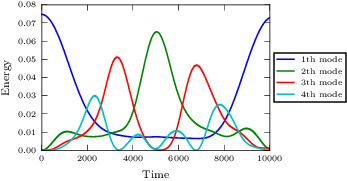

Full code: `pySDC/projects/Hamiltonian/fput.py <https://github.com/Parallel-in-Time/pySDC/blob/master/pySDC/projects/Hamiltonian/fput.py>`_

.. literalinclude:: ../../../pySDC/projects/Hamiltonian/fput.py

Results:

.. literalinclude:: ./data/fput_out.txt

.. image:: ./data/fput_hamiltonian.png
   :scale: 100 %
.. image:: ./data/fput_positions.png
   :scale: 100 %
.. image:: ./data/fput_energy.png
   :scale: 100 %
