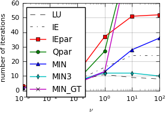
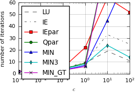
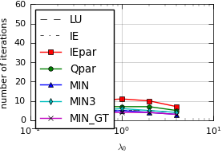

Full code: `projects/parallelSDC/preconditioner_playground.py <https://github.com/Parallel-in-Time/pySDC/blob/master/projects/parallelSDC/preconditioner_playground.py>`_

.. literalinclude:: ../../../projects/parallelSDC/preconditioner_playground.py

Results:

.. image:: ../../../data/parallelSDC_preconditioner_vanderpol.png
   :scale: 100 %

