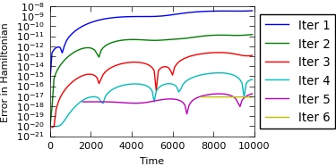

Full code: `pySDC/projects/Hamiltonian/solar_system.py <https://github.com/Parallel-in-Time/pySDC/blob/master/pySDC/projects/Hamiltonian/solar_system.py>`_

.. literalinclude:: ../../../pySDC/projects/Hamiltonian/solar_system.py

Results:

