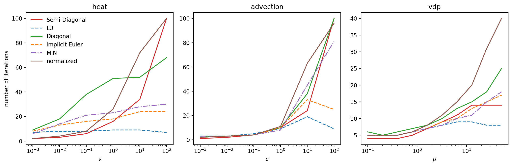

Getting Diagonal Preconditioners from Adaptivity
------------------------------------------------
Our goal here is to use optimisation to derive new diagonal preconditioners using adaptivity.
That means we run a problem with adaptivity and count iterations.

For optimisation, we need to define a cost function, which takes as input the values on the diagonal of the preconditioner and returns the iteration count, which we want to minimize.

As test problem we start with advection with a Gaussian initial distribution, since that way we get many frequencies in the spatial domain, so if we can solve this problem really well, I think we should be able to tackle all problems rather well.
Somebody who knows more about this should correct me if I am wrong, though!

Objective Function
------------------
Again, we write a function that takes as input the diagonal elements of the preconditioner, runs a problem with adaptivity enabled and then returns the number of iterations that were required.
Adaptivity controlls the accuracy and the idea is that a preconditioner with a faster contraction rate can achieve the same accuracy with larger step size, provided it remains stable.
Adaptivity will detect this since it will increase step size to avoid over-resolving.

Adaptivity works with the embedded error, which means subtracting two solutions of different order, thus getting an approximation for the local error of the lower order method.
With SDC, this corresponds to simply subtracting two iterates.
One problem, however, is that we are not guaranteed that this holds for arbitrary preconditioners.
While optimizing, we sometimes converged in extremely few iterations with the embedded error estimate where it should be, but global error was actually quite large.

Anyways, we need to incorporate another meassure of how well the problem is solved in the cost function so that we enforce high accuracy.

Embedded Error Estimate
-----------------------
If the contraction rate is very low, the embedded error estimate will also be very low.
The estimate critically depends on one solution being significantly more accurate than the other one, which we usually guarantee by increasing the order by one.
If this is not the case, the estimate becomes completely meaningless and does not approximate the local error at all.
Putting this random value with no connection to the local error into adaptivity will produce spuriously large step sizes.
This is a big issue...

Assessing the quality of preconditioners
----------------------------------------
It is apparently vital to choose a random initial guess for the Dahlquist problems when computing the contraction factor.
The initial conditions, however are left at one, but the initial guess for the collocation nodes needs to be random.

TODO
----
 - Try adaptivity with extrapolation estimate instead of embedded estimate
 - Penalize a bad solve of the problem by checking the residual during run time
 - Do heatmap with dahlquist problems instead of advection
 - I might need to consider Fourier modes in time as well as in space, since I am looking to solve multiple time steps at once.

Results log
-----------
The first problem I ran was advection with a Gaussian for initial conditions.

.. include:: data/notes/Fourier.rst
