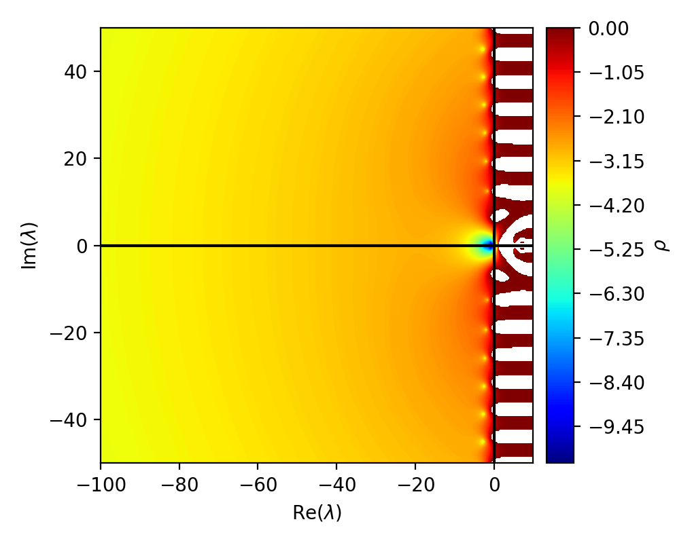

# Fourier decomposition

Fourier transforms provide an invaluable tool for analysing convergence properties, since they can be used to write partial differential equations (PDEs) as systems of Dahlquist problems.
This is even possible for some discrete versions of PDEs, such as finite difference (FD) discretizations.

## Eigenvalues of finite difference schemes

 
Since we are looking at FD schemes with periodic boundary conditions, the space matrices are circulant matrices $C \in \mathbb{R}^{N\times N}$.
These have in each row elements $c_j$, which get shifted by one for each row, i.e. $C_{ij} = c_{i+j}$.
The eigenvalues of this type of matrix are known:

$$
\lambda_k = \sum_{j=0}^{N-1} c_j \exp\left(i\frac{2\pi}{N}kj\right)
$$

The corresponding eigenvectors are

$$
\Psi_k = \frac{1}{\sqrt{N}} \left[ \exp\left(i\frac{2\pi}{N}k\cdot 0\right), \exp\left(i\frac{2\pi}{N}k\cdot 1\right), ..., \exp\left(i\frac{2\pi}{N}k\cdot (N-1)\right) \right]^T,
$$

such that $\left(\Psi^T C \Psi\right)_{jj} = \lambda_j$.

To see the connection to Fourier transforms, first consider the discrete Fourier transform (DFT) of the solution at spatial point $x_n$ and time $t$, $u(x_n, t)$:

$$u(x_n) = \sum_{k=0}^{N-1} \hat{u}_k \exp(i\frac{2\pi k}{N}x_n)$$

Now, consider the DFT of the solution at the next point in space $x_{n+1} = x_n + \Delta x$:

$$u(x_{n+1}) = \sum_{k=0}^{N-1} \hat{u}_k \exp\left(i\frac{2\pi k}{N}(x_{n} + \Delta x)\right) = \sum_{k=0}^{N-1} \hat{u}_k \exp\left(i\frac{2\pi k}{N}x_{n}\right) \cdot \exp\left(i\frac{2\pi k}{N}\Delta x\right).$$

We can see that the index shift has become a multiplication by an exponential.
Using the orthogonality relation

$$\int \exp\left(i\frac{2\pi}{N}nx\right)\exp\left(i\frac{2\pi}{N}mx\right)dx = \delta_{mn},$$

with $\delta_{mn}$ the Kronecker delta, we can see that the modes behave independently of each other if we multiply by a mode and integrate.

This means that, for instance, a second order centered difference advection problem 

$$\partial_t u_n = -c\frac{u_{n+1} - u_{n-1}}{2 \Delta x}$$

is equivalent to a system of Dahlquist equations in Fourier space

$$\partial_t \hat{u}_k = \frac{-c}{2 \Delta x} \left(\exp(i 2\pi / N k \Delta x) - \exp(-i 2\pi/N k\Delta x)\right)\hat{u}_k.$$

In the last equation, we see that the symmetric part in the exponential is cancelled and employing Euler's formula $\exp(ix)=\cos(x)+i\sin(x)$, we can immediately see that the eigenvalues lie on the imaginary axis.
This turns out to be true for all central difference schemes for the first derivative.

In contrast, if we consider the heat equation discretized by a similar second order central difference stencil

$$\partial_t u_n = \nu \frac{u_{n+1} + u_{n-1} - 2u_n}{2 \Delta x},$$

we get in Fourier space

$$\partial_t \hat{u}_k = \frac{\nu}{\Delta x}\left(\cos\left(\frac{2\pi}{N}k\Delta x\right) - 1\right)\hat{u}_k,$$

and we find the eigenvalues to lie exclusively on the negative real axis, since this time the antisymmetric part is cancelled.

## Analysing convergence properties of finite difference schemes in SDC with DFT

Let us review what we achieved by looking at the discretized PDE in Fourier space.
By using the orthogonality relation, we were able to transform the system of equations where the time derivative of one unknown depends on the values of other unknowns into a system of equations where the time derivatives depend exclusively on the values of the same unknown.
We have disentangled the FD scheme!
Not only that, we managed to write the FD scheme as Dahlquist problems, which we are well familiar with, since the Dahlquist problem is just about the simplest ordinary differential equation imaginable.
To fix the notation, we write the Dahlquist problem here:

$$u_t = \lambda u,$$

with problem parameter $\lambda \in \mathbb{C}$.
Notice this is an ordinary differential equation, so there is no space index.
For $\lambda$ on the negative real axis, the exact solution will decay exponentially, for $\lambda$ on the imaginary axis, the exact solution will oscillate and for $\lambda$ on the positive real axis, the exact solution will grow exponentially.

This is coherent with where we found the eigenvalues of the FD stencils of advection and heat equations to be; the magnitudes of the modes will oscillate for the advection problem, where the magnitude of the solution stays the same, but it moves around in space and the magnitudes of the modes will decay for the heat equation, where the solution stays put, but decays.

Our strategy for analysing the convergence properties of SDC with a given preconditioner and FD discretization will be to first plot the performance of SDC for a range of Dahlquist problems with $\lambda$ in a patch of the complex plane.
Then we will see where the eigenvalues of our FD scheme lie in the complex plane, and finally we need to check which of these modes are represented in the initial conditions of the problem that we want to solve, or more precisely, in the error.

Let's start with plotting the contraction factor after four iterations.
Since we know the exact solution to the Dahlquist problem, we can just compare the initial and final errors to determine how the error shrinks.
To introduce the concepts, we will stick with implicit Euler as a preconditioner for the plots, before repeating the same plots with different preconditioners to assess their quality.

<em>Logarithmic contraction factor for SDC with implicit Euler preconditioner after four iterations.
The error is rising for some values with Re($\lambda$)>0 and for some values on the imaginary axis, but implicit Euler is A-stable, which means that error is contracting on the entire left half plane.</em>

 
We already know where the eigenvalues of heat and advection equations fall in the complex plane, so we can just plot them on top of the contraction factor.
To keep things interesting, however, we will use stencils with different eigenvalues, namely a second order forward difference stencil for the heat equation and a 5th order backward difference stencil for advection.
While these choices of stencils are not necessarily smart for solving the problem, their eigenvalues are spread across the complex plane rather than just falling on a particular axis.
   

<em>Eigenvalues of the stencils we use to solve heat and advection problems. For the advection problem, we have many eigenvalues in the negative half plane, which means the backward (or upwind in this case) stencil is better than a centered stencil.
   For the heat equation, however, the one sided stencil is clearly worse than a centered one, since now we have a substiantial amount of eigenvalues in the positive half plane, where the error is growing with each iteration.</em>

What can we deduce?
We know that some frequency components will decay and others will grow, so we cannot make a clear statement on how the overall error will behave.
For this, we have to match the eigenvalues with their frequencies and determine which frequencies are active.
 
We choose a Gaussian distribution as initial conditions, since that is composed of Fourier modes of multiple frequencies.
Then, we determine the error and apply a DFT to it.
Repeating the plot, but only with eigenvalues which modes are represented sufficiently strong, we get

.. figure:: rho-IE-FD-eigenvals-active.png
   :align: center
   :width: 100%
   :alt: Eigenvalues of active modes in the FD schemes

   Eigenvalues of active modes when solving the problems.
   A somewhat well resolved Gaussian will consist mostly of low frequency components, which results in similar behaviour as the centered stencils discussed before.
   For advection, the eigenvalues lie on the imaginary axis, whereas the eigenvalues of the heat equation are in the negative half plane and close to the real axis.

Interpretation...
