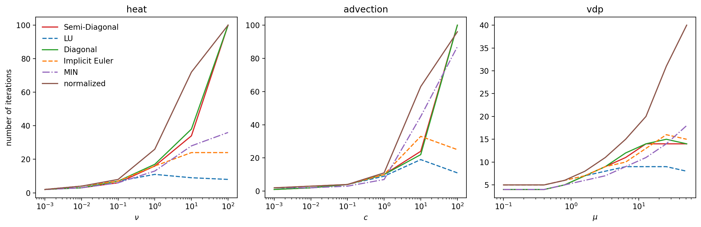
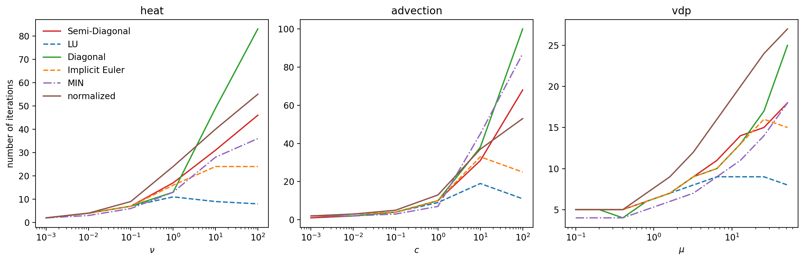
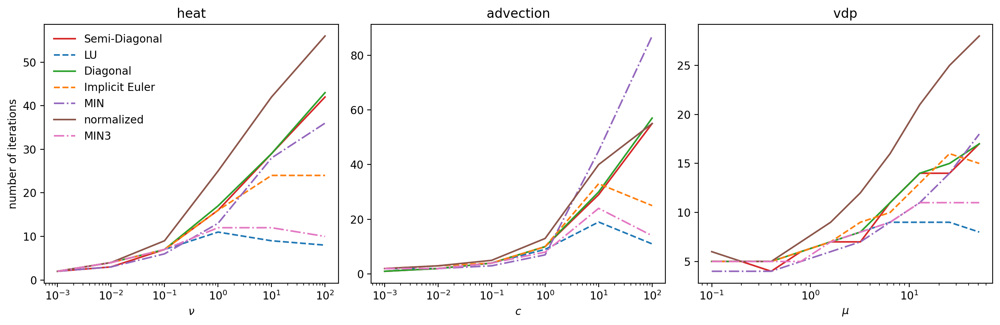
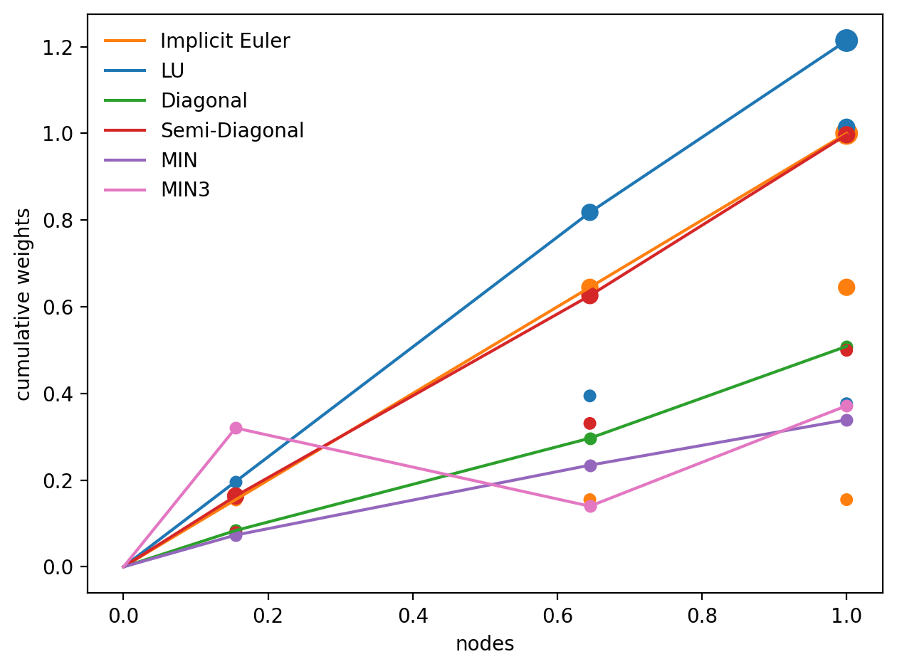

# Optimizing preconditioners using adaptivity

We attempt to construct new preconditioners, which maximize the step sizes that we are allowed to take to reach a given tolerance.
In order to allow for parallelization across the method, we will allow only diagonal elements in the preconditioners and elements in the first column, which correspond to the initial conditions, which are also known on all ranks and do not require more communication.

## Optimization setup
We start out with two model problem that we want to solve, namely advection and diffusion.
We choose Gaussian initial conditions and one-sided finite difference stencils in order to capture diverse dynamics.
See [this note](Fourier.md) for some discussion on the properties in Fourier space.

We then setup the usual adaptivity based on an embedded error estimate, which utilizes the increment between iterations as an approximation to the error of the previous iteration.
This is then compared to a tolerance and using an update rule based on the order of the scheme, we compute new step sizes during runtime.
Since we perform the same number of iterations in each step in order to fix the order, we can maximize the step sizes by minimizing the numbers of iterations.
Notice that minimzing the iteration count incorporates minimizing the number of restarts of steps as well.

For minimization, we need only two ingredients.
First of all, we need a minimization alogrithm, for which we employ `scipy.optimize.minimize` with Nelder-Mead.
Then we need an objective function, which takes as input the elements of the preconditioner and some sort of cost required to solve a model problem to the desired accuracy.

Given that we reduce the partial differential equations to systems of Dahlquist problems, it makes sense to consider Dahlquist problems directly, which we do, which choosing problem parameters in the top left quarter of the complex plane.
In particular, we include values on the negative real and positive imaginary axes, which we hope to help us represent the dynamics of advection and heat equation.

### Objective function
For the objective function, we start out with the simplest possible configuration: We just set the accuracy of the problem by setting a tolerance for adaptivity and trust it to behave well and use as the cost exclusively the iteration number.

More intricate functions are quite feasible.
For instance, one could compare to runs with the LU preconditioner and terms of the actual error, rather than trusting that all goes well.

### Configurations
We can pair objective functions with different configurations for allocating the numbers that the optimiation algorithm provides to the preconditioner.
The simplest imaginable one is of course to just put the numbers on the diagonal, leaving the first element zero, since we don't want to change the initial conditions (the sweeper would skip this anyway.)

The next step is to put half of them on the diagonal and the other half in the first column.
This concept allows parallel Crank-Nicholson instead of just parallel Euler as you get from diagonal elements only, but once optimization starts, we get something ``random.''
We call this semi-diagonal.

The third option we try is to normalize the diagonal elements to one.
Ultimately, the preconditiner is a quadrature rule to solve the error equation, so it would make sense for it to approximate an integral.
This requires it to be normalized, however in a very different way as we do here, so there is no theoretical foundation for this.
We would want the sum of all weights we use for approximating the integral to equal the step size to which we integrate.
However, this works on a node level, meaning with only diagonal elements the only choice that normalizes the weights appropriately is implicit Euler.
Alowing also the initial conditions, more options are possible, but there is no motivation for applying optimization here over the second order Crank-Nicholson.
But hey, what sort of motivation do we have for any of this?
We can try whatever we want...

Also, we try optimization with random initial guesses in the sweeper.
Crucially, this does not mean random initial conditions, the initial guess only refers to how we initialize the intermediate solutions at the collocation nodes.

We record the full set of pySDC parameters [here](configurations.md).

### Initial conditions for the optimization
When optimizing, we will, if all goes well, obtain some local minimum and one problem of minimization is that you can never be quite sure if there is a better minimum, so you don't care and just take the one you have (as far as I know.)
However, which local minimum you end up in depends on the initial conditions for the optimization algorithm.

We've seen later on that the MIN preconditioner integrates significantly shorter than the length of a time step.
When we chose as initial conditions parallel Euler over half a time step, we get a preconditioner that performs much better in the stiffness test as when we start out with Euler over the full step.
Why, you may ask?
Well, the answer is presumably hidden in the cosmic microwave background.

## Numerical results
To compare the performance of our newly obtained preconditioners, we do the same plots as Robert did in his paper [Parallelizing spectral deferred corrections across the method](https://doi.org/10.1007/s00791-018-0298-x), where he compared advection, diffusion and van der Pol oscillator problems and varied the problem parameter from non-stiff to stiff.
We start with plots obtained with advection as the model problem.
Please look [here](metadata.md) for a reference on the preconditioners that we use.

We find that employing heat and advection model problems leads to very similar preconditioners.

<em>The problem parameters range from non-stiff on the left to stiff on the right.
Solid lines represent preconditioners obtained with optimization, whereas dashed lines are serial preconditioners and dot-dashed lines show diagonal preconditioners from Robert's paper.
Evidently, the normalized diagonal preconditioner is more effecicient than its non-normalized counterpart, for no apparent reason.
Diagonal and semi-diagonal preconditioners require almost identical iteration counts.
</em>

<em>Repeating the plot, but with preconditioners obtained using diffusion, we can see remarkably similar performance compared to the advection based optimizaiton.
Interestingly, this time the normalized preconditioner is performing poorly.
</em>

<em>This plot shows again advection, but this time a random initial guess was used to initialize the intermediate solutions at the collocation nodes.
We can see that this indeed inmproves the capabilities of the preconditioners to handle stiff problems.
In particular, the semi-diagonal preconditioner can compete with MIN.
Since doing the same with the heat equation as a model problem yielded very similar behaviour, we show only advection here.
</em>

Doing this with series of Dahlquist problems directly, we can actually get much better results than with advection or heat equation.

<em>Preconditioners were obtained with Dahlquist problems and random initial guess.
They represent the best behaviour we have seen so far.
</em>

To visualize the values in the preconditioners, we plot the cumulative sum of the weights.
Keep in mind that the preconditioner is a quadrature rule that is used to solve the error equation.
We have solutions at the times of the quadrature nodes and we wish to integrate the error until then, so that we can refine the solutions appropriately.
However, it turns out that preconditioners that emerge from linear algebra (LU) or optimization will not at all integrate to the time associated with the solutions.
Instead, LU will integrate past the step size, whereas diagonal only preconditioners solve a much shorter interval than the step size.
Particularly wackadoodle is the MIN3 preconditioner.
Not only do have no idea how it was obtained, but the weights are not even increasing, which means the second node is refined with the error at a time earlier than the correction for the first node.
Why the hell would you do this and more importantly, why on earth does it work so well?
Note that the full quadrature rule, which is used to compute the residual defines the integration structure, and is responsible for communication of the intermediate solutions between sweeps, which means the order in time corresponding to the solutions is indeed fixed.

<em>Visualization of the weights in the preconditioners.
</em>

