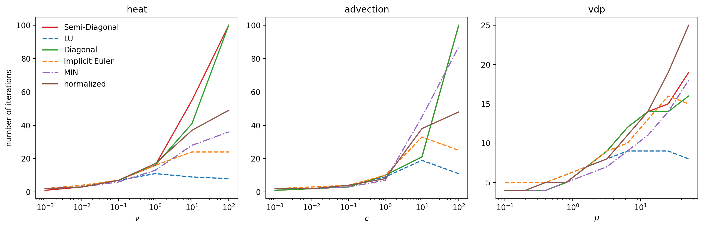

# Optimizing preconditioners using adaptivity

We attempt to construct new preconditioners, which maximize the step sizes that we are allowed to take to reach a given tolerance.
In order to allow for parallelization across the method, we will allow only diagonal elements in the preconditioners and elements in the first column, which correspond to the initial conditions, which are also known on all ranks and do not require more communication.

## Optimization setup
We start out with two model problem that we want to solve, namely advection and diffusion.
We choose Gaussian initial conditions and one-sided finite difference stencils in order to capture diverse dynamics.
See [this note](Fourier.md) for some discussion on the properties in Fourier space.

We then setup the usual adaptivity based on an embedded error estimate, which utilizes the increment between iterations as an approximation to the error of the previous iteration.
This is then compared to a tolerance and using an update rule based on the order of the scheme, we compute new step sizes during runtime.
Since we perform the same number of iterations in each step in order to fix the order, we can maximize the step sizes by minimizing the numbers of iterations.
Notice that minimzing the iteration count incorporates minimizing the number of restarts of steps as well.

For minimization, we need only two ingredients.
First of all, we need a minimization alogrithm, for which we employ `scipy.optimize.minimize` with Nelder-Mead.
Then we need an objective function, which takes as input the elements of the preconditioner and some sort of cost required to solve a model problem to the desired accuracy.

### Objective function
For the objective function, we start out with the simplest possible configuration: We just set the accuracy of the problem by setting a tolerance for adaptivity and trust it to behave well and use as the cost exclusively the iteration number.

More intricate functions are quite feasible.
For instance, one could compare to runs with the LU preconditioner and terms of the actual error, rather than trusting that all goes well.

### Configurations
We can pair objective functions with different configurations for allocating the numbers that the optimiation algorithm provides to the preconditioner.
The simplest imaginable one is of course to just put the numbers on the diagonal, leaving the first element zero, since we don't want to change the initial conditions (the sweeper would skip this anyway.)

The next step is to put half of them on the diagonal and the other half in the first column.
This concept allows parallel Crank-Nicholson instead of just parallel Euler as you get from diagonal elements only, but once optimization starts, we get something ``random.''

The third option we try is to normalize the diagonal elements to one.
Ultimately, the preconditiner is a quadrature rule to solve the error equation, so it would make sense for it to approximate an integral.
This requires it to be normalized, however in a very different way as we do here, so there is no theoretical foundation for this.
We would want the sum of all weights we use for approximating the integral to equal the step size to which we integrate.
However, this works on a node level, meaning with only diagonal elements the only choice that normalizes the weights appropriately is implicit Euler.
Alowing also the initial conditions, more options are possible, but there is no motivation for applying optimization here over the second order Crank-Nicholson.
But hey, what sort of motivation do we have anyways?
We can try whatever we want...

We record the full set of pySDC parameters [here](configurations.md)

## Numerical results
To compare the performance of our newly obtained preconditioners, we do the same plots as Robert did in his paper [Parallelizing spectral deferred corrections across the method](https://doi.org/10.1007/s00791-018-0298-x), where he compared advection, diffusion and van der Pol oscillator problems and varied the problem parameter from non-stiff to stiff.
We start with plots obtained with advection as the model problem.

<em>Eigenvalues of active modes when solving the problems with refined step size.
   Contraction factors with reduced step size.
   The error for the heat equation now decays more slowly, because we take smaller steps, but for the advection problem, the smaller step size is required to ensure convergence at all.
   Notice that the optimal step size is hence different for the two problems.</em>

