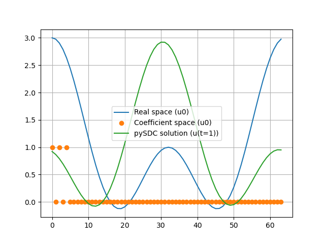

# Playground to use Dedalus with pySDC

:scroll: Interface for [Dedalus code](https://dedalus-project.readthedocs.io/en/latest/) so it can be used within the pySDC framework.

> :warning: This is only compatible with the latest version of Dedalus

## Usage Example

See [demo.py](./scratch.py) for a first demo script using pySDC to apply SDC on the Advection equation.

1. Define the problem, as it would have been done with Dedalus

```python
import numpy as np
import dedalus.public as d3

# Coordonates, distributor and basis
coords = d3.CartesianCoordinates('x')
dist = d3.Distributor(coords, dtype=np.float64)
xbasis = d3.RealFourier(coords['x'], size=64, bounds=(0, 2*np.pi))
u = dist.Field(name='u', bases=xbasis)

# Initial solution
x = xbasis.local_grid(dist, scale=1)
listK = [0, 1, 2]
u0 = np.sum([np.cos(k*x) for k in listK], axis=0)
np.copyto(u['g'], u0)

# Problem
dx = lambda f: d3.Differentiate(f, coords['x'])
problem = d3.IVP([u], namespace=locals())
problem.add_equation("dt(u) + dx(u) = 0")
```

2. Define the pySDC parameters

```python
from problem import DedalusProblem
from sweeper import DedalusSweeperIMEX
from pySDC.implementations.controller_classes.controller_nonMPI import controller_nonMPI

nSweeps = 3
nNodes = 4
tEnd = 1
nSteps = 10
dt = tEnd / nSteps

# pySDC controller settings
description = {
    # Sweeper and its parameters
    "sweeper_class": DedalusSweeperIMEX,
    "sweeper_params": {
        "quad_type": "RADAU-RIGHT",
        "num_nodes": nNodes,
        "node_type": "LEGENDRE",
        "initial_guess": "copy",
        "do_coll_update": False,
        "QI": "IE",
        "QE": "EE",
        'skip_residual_computation': ('IT_CHECK', 'IT_DOWN', 'IT_UP', 'IT_FINE', 'IT_COARSE'),
    },
    # Step parameters
    "step_params": {
        "maxiter": 1,
    },
    # Level parameters
    "level_params": {
        "dt": dt,
        "restol": -1,
        "nsweeps": nSweeps,
    },
    "problem_class": DedalusProblem,
    "problem_params": {
        'problem': problem,
        'nNodes': nNodes,
    }
}
```

Here the `DedalusProblem` (defined in [`problem.py`](problem.py)) and the `DedalusSweeperIMEX` (defined in [`sweeper.py`](./sweeper.py)) are the main interfaces between Dedalus and pySDC.

3. Instantiate the controller and run the simulation

```python
controller = controller_nonMPI(
    num_procs=1, controller_params={'logger_level': 30},
    description=description)

prob = controller.MS[0].levels[0].prob
uSol = prob.solver.state
tVals = np.linspace(0, tEnd, nSteps + 1)

for i in range(nSteps):
    uSol, _ = controller.run(u0=uSol, t0=tVals[i], Tend=tVals[i + 1])
```

Then `uSol` contains a list of `Fields` that represent the final solution of the simulation. Running the [`demo.py`](./demo.py) script produce the following output :

<p align="center">
  
</p>

See an other example with the [Burger equation](./burger.py)


## Use a pySDC based time-integrator within Dedalus

This playground also provide a standalone SDC solver that can be used directly,
see the [demo file for the Burger equation](./burger_ref.py).

To use this standalone time-integrator, simply do :

```python
# Base import
from pySDC.playgrounds.dedalus.sdc import SpectralDeferredCorrectionIMEX

# Setup SDC parameters (non set parameters use default values ...)
SpectralDeferredCorrectionIMEX.setParameters(
    nSweeps=4,
    nNodes=4,
    implSweep="MIN-SR-S",
    explSweep="PIC")
```

then you can use this class when instantiating and using a Dedalus solver simply like this :

```python
solver = problem.build_solver(SpectralDeferredCorrectionIMEX)
timestep = 2e-3  # dummy value for example ...
while solver.proceed:
    solver.step(timestep)
```

A full example script for the 2D Rayleigh-Benard Convection problem can be found [here](./rayleighBenardSDC.py).