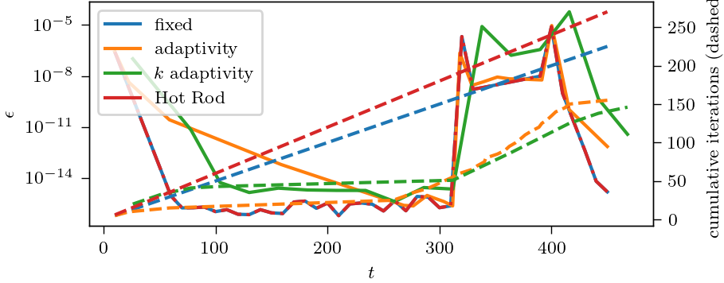
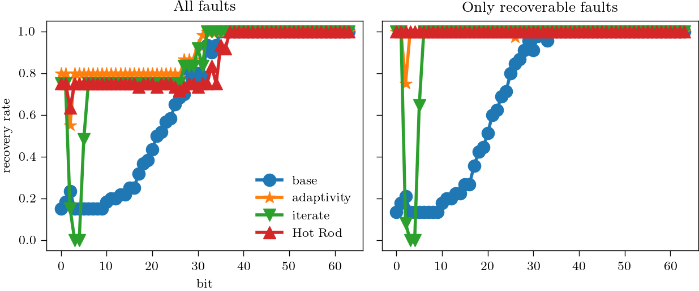

# Resilience in the Lorenz Attractor

## Strategies
We look at the familiar resilience strategies here, which are
 - *base*: Fixed step size and fixed iteration count
 - *adaptivity*: Adaptive step size and fixed iteration count
 - *iterate*: Fixed step size and adaptive iteration count
 - *Hot Rod*: Fault detector from [here](https://doi.org/10.1007/978-3-319-43659-3_47).

First, let's convince ourselves that we solving the problem to similar accuracy with all schemes by making sure the maximal local error is comparable:

<em>Accuracy and cost of the resilience strategies under investigation.
</em>

As we are used to, we need to perform one additional iteration with no gain in accuracy for Hot Rod.
Adaptivity and iterate on the other hand solve the problem with higher computational efficiency, but the step size can be tuned significantly more finely than the iteration number, giving an edge to adaptivity.

So we have established that the different strategies substantially impact computational efficiency, but what about their resilience capabilities?

## Resilience Capabilities
First, we see what the overall recovery rate is and what faults are not fixed.
To this end, we insert faults in every possible way at $t=0.3$, which gives us 3840 combinations to perform some statistics.

As usual, we cannot fix faults to the initial conditions and adaptivity cannot fix faults in the last iteration.
Also, we don't try to recover from faults that crash the code.
But what about other faults?

<em>Recovery rate vs. bit that was flipped for Lorenz attractor problem. Which faults can be recovered differs for some strategies.
</em>

### Base
Even though the Lorenz attractor is known for being quite chaotic, flipping bits after about 35 perturb the solution by less then the accuracy we solve the problem to, which has negligible effects on the final solution.

Faults that occur in significant bits, such as sign bits, which are recovered, occur, with only few exceptions, in the last iteration in nodes other than the last node.
These don't propagate to the solution of the step since the quadrature rule includes the right interval boundary.

### Hot Rod
We find that Hot Rod will fix all faults that it can, which is nice!

### Adaptivity
Adaptivity struggles with some faults in bit 2. 
Apparently, there is some memory overflow which causes mild mayhem that doesn't crash the code, but causes unexpected behaviour.
Looking in detail at a run with such a fault revealed that the residual was `nan` and adaptivity decided to increase the step size dramatically after the fault occurred.

### Iterate
Just iterating the faults away does not always work when flipping bits in the exponent.
Looking at a run in detail, we can see that the residual increases by about 150 orders in magnitude.
Following that, it oscillates around this value by 20 or so orders of magnitude.
Possibly, the Newton solver falls subject to overflows somewhere, keeping it from converging, or it would require more than the 99 iterations that we grant it for convergence.
Regardless, after 99 iterations of SDC, which is the maximum that we allow, we are no closer to a solution of the collocation problem than after the fault, so this is no good.

Faults to mantissa bits are, however, recovered efficiently.