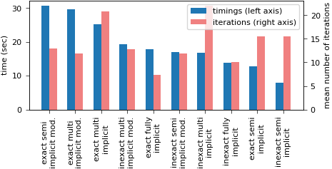
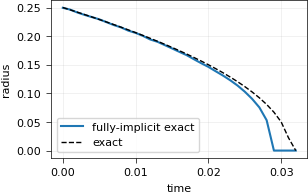
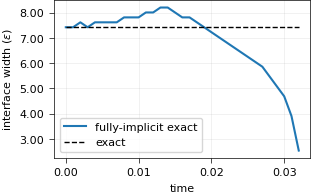
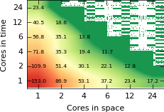
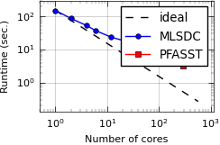

Examples of the pySDC paper in ACM TOMS
=======================================

This project holds the numerical examples of the paper that introduced pySDC,
`Algorithm 997: pySDC—Prototyping Spectral Deferred Corrections <https://doi.org/10.1145/3310410>`_,
ACM Transactions on Mathematical Software 45(3), 2019.
There are two of them: a comparison of SDC variants for the Allen-Cahn equation, and space-time parallel runs of the
heat equation with PETSc.

SDC variants for the Allen-Cahn equation
----------------------------------------

``AllenCahn_contracting_circle.py`` solves the 2D Allen-Cahn equation on 128x128 points, with a circle of radius
0.25 that shrinks and vanishes, until :math:`T=0.032` with :math:`\Delta t = 10^{-3}`.
It runs the same setup with five ways to split the equation, all from ``AllenCahn_2D_FD``:

- ``fully-implicit``: the whole right-hand side implicit, solved with Newton's method;
- ``semi-implicit`` and ``semi-implicit_v2``: IMEX SDC, with two different splittings into an implicit and an
  explicit part;
- ``multi-implicit`` and ``multi-implicit_v2``: multi-implicit SDC, which treats two parts of the right-hand side
  implicitly, each with its own solver, again with two different splittings.

Each variant runs with exact inner solves and with inexact ones (a single Newton step, or at most 10 iterations of
the linear solver). The plots show the time to solution and the mean number of iterations of each variant, and for the exact fully implicit one the
radius of the circle against the exact radius, and the width of the interface against its initial width:

Space-time parallel runs with PETSc
-----------------------------------

``pySDC_with_PETSc.py`` solves the forced 2D heat equation with PETSc data types and solvers, and runs MLSDC or
PFASST with ``controller_MPI``.
It splits ``MPI.COMM_WORLD`` into communicators in space and in time: the number of ranks in space is the first
command-line argument, and the remaining factor of the ranks goes to time.
The runs for the paper were made on JURECA, with the JUBE files ``jube_pySDC_with_PETSc.xml`` and
``run_pySDC_with_PETSc.tmpl``; ``README_JURECA.txt`` explains the setup there.
Their results are in ``data/result_*_NEW.dat``, and ``visualize_pySDC_with_PETSc.py`` turns them into the runtimes on up to
24 cores, split between space and time, and the runtimes of MLSDC and PFASST against the number of cores:

Tests
-----

The tests run the five Allen-Cahn variants, with exact and with inexact solves, and plot them, and plot the stored
results of the PETSc runs. The plots above are made by the CI: the Allen-Cahn ones from the current code, the PETSc ones
from the stored results.
