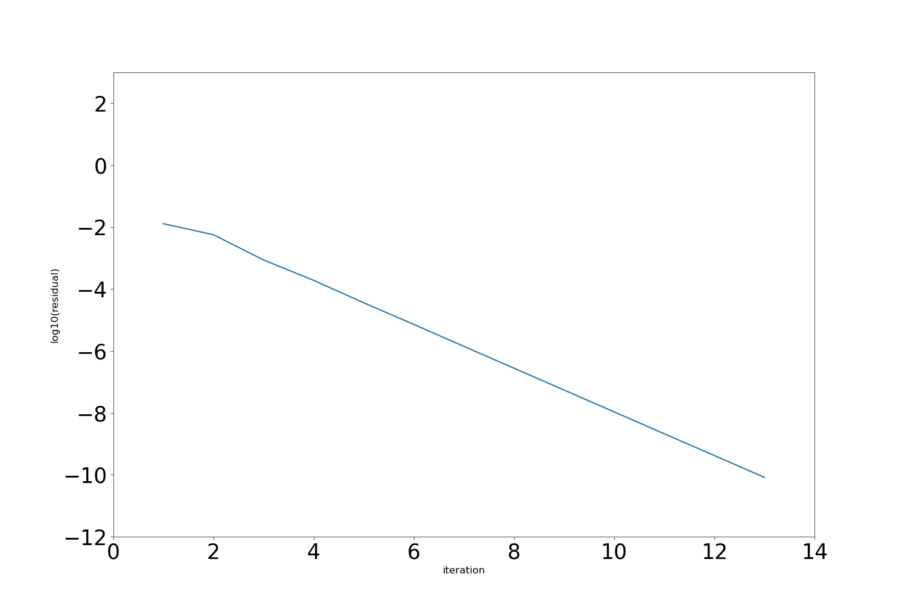
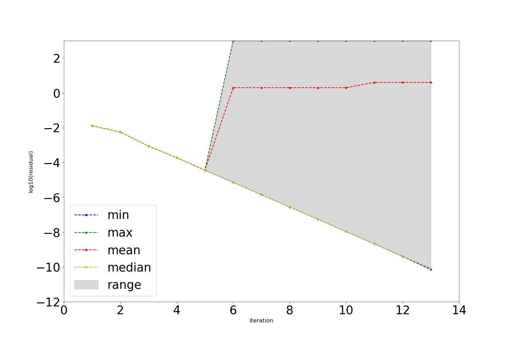
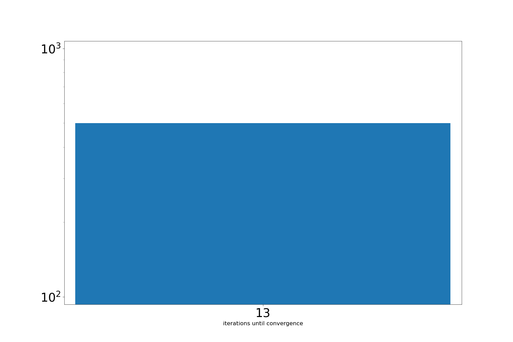

Soft faults in SDC
==================

In this project, we inject bit flips into SDC sweeps, detect them and repeat the affected part of the sweep.
Unlike a crash, such a *soft* fault does not stop the run; it silently changes a number, which the iteration
may or may not recover from.

Injecting, detecting and correcting faults
------------------------------------------

``implicit_sweeper_faults.py`` is a ``generic_implicit`` sweeper that can do all three:

- **Injection:** in one iteration per run, chosen at random, the sweeper flips a random bit (mantissa, exponent or
  sign) of a random entry of either the solution or the right-hand side at a random collocation node.
  The hook in ``FaultHooks.py`` picks the iteration, below the number of iterations the run needs without faults.
- **Detection:** after each implicit solve, the sweeper computes the residual of that solve. If its maximum norm is
  larger than ``detector_threshold``, or not a number, a fault is detected.
- **Correction:** with ``allow_fault_correction``, the sweeper then repeats the solve at that node, once.

The sweeper counts detected and missed faults, false positives, and false positives during a correction.

Statistics for the van der Pol oscillator
-----------------------------------------

``generate_statistics.py`` runs one time step of the van der Pol oscillator with :math:`\mu = 18` without faults, to
get the number of iterations, and then 500 times with faults.
It writes the detector's true and false positives and negatives, its F-score, precision, true and false positive rates
(after Sloan, Kumar and Bronevetsky, 2012) into ``data/vanderpol_500_runs_Statistics.txt``, and plots the residual of
the last run, the smallest, largest, mean and median residual over all runs, and a histogram of the number of
iterations:

The same file has setups for the heat equation (``diffusion_setup``) and the generalized Fisher equation
(``reaction_setup``), which ``main`` does not run.

Tests
-----

The test runs ``generate_statistics.py``; the plots above are made by the CI, from the current code.
